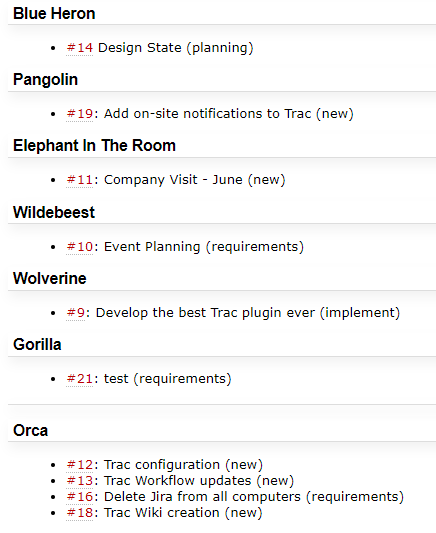

# ProjectTasks Trac Plugin

ProjectTasks is a Trac plugin that provides a macro to display tasks for each project in a dynamic and user-friendly manner. It encourages better organization and productivity in project management.

## Table of Contents

- [ProjectTasks Trac Plugin](#projecttasks-trac-plugin)
  - [Table of Contents](#table-of-contents)
  - [Features](#features)
  - [Installation](#installation)
  - [Usage](#usage)
  - [Contribution](#contribution)
  - [License](#license)

## Features

- Dynamically lists all active projects.
- Displays all associated tasks for each project.
- Allows you to expand or collapse the tasks list for each project.
- Provides links to each task for easy navigation.



## Installation

1. Clone the repository or download the ZIP file and extract it.
2. Open your terminal and navigate to the root directory (`ProjectTasks/`).
3. Run the command `python setup.py bdist_egg`. This will create a `.egg` file in a new `dist/` directory.
4. Copy the `.egg` file to your Trac environment's `plugins` directory.
5. Add the following line to the `[components]` section of your `trac.ini` file to enable your plugin:

```
[components]
project_tasks.project_tasks.ProjectTasksMacro = enabled
```

6. Restart your Trac server.

## Usage

To use the ProjectTasks macro, simply add the following to any of your Trac wiki pages:

```
{{{#!ProjectTasks
}}}
```

The macro will be replaced by a list of all projects and their associated tasks, with each task linked to its respective Trac ticket.

## Contribution

Contributions are always welcome! Please read the [contribution guidelines](./CONTRIBUTING.md) first.

## License

[MIT](./LICENSE)
